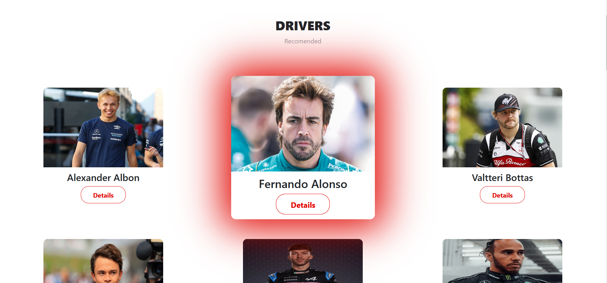
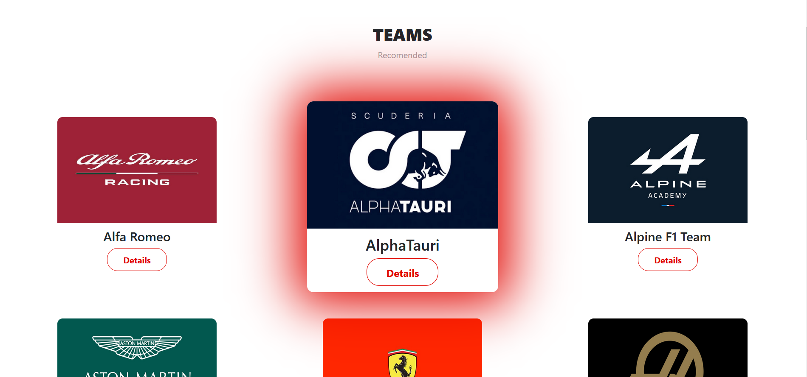
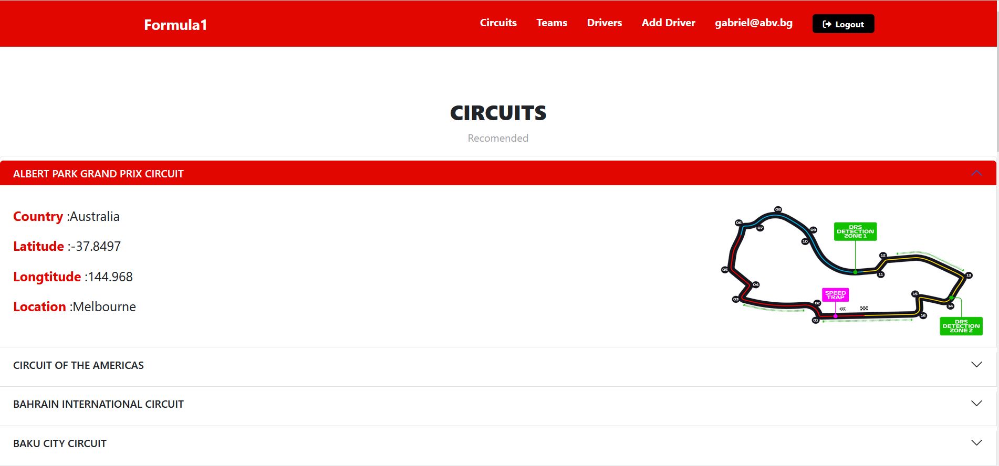
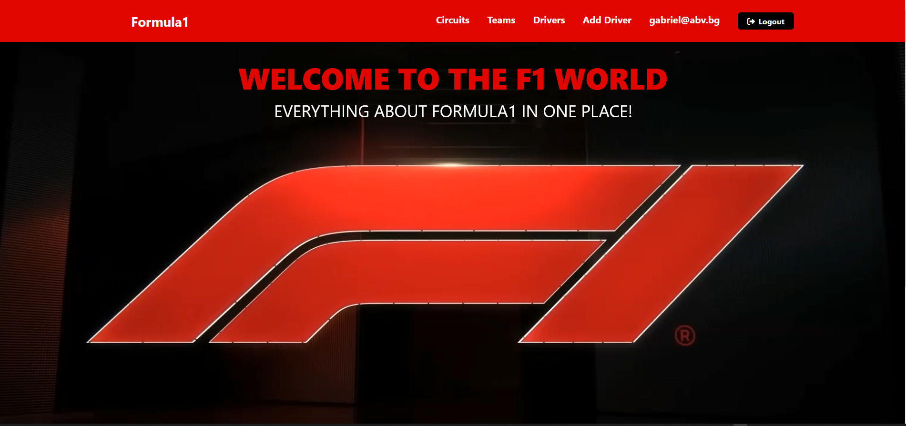

# Formula1-Website

This is the Formula 1 web project using ReactJS.The purpose of the project to provide a platform to Formula 1 fans to get information about teams, drivers and circuits!


<details open='open'>
 <summary>Table of Contents</summary>
<ul>
<li><a href="#features">Features</a></li>
<li><a href="#Screenshots">Screenshots</a></li>
<li><a href='#installation'>Installation</a></li>
<li><a href='#technologies'>Technologies</a></li>
<li><a href='#contributing'>Contributing</a></li>
<li><a href='#used-information'>Used Information</a></li>
</details>

</ul>

   ## Features

   <ul>

   <li>A Guest have access only to the basic website information</li>
   <li>Sign in functionality</li>
   <li>Register functionality</li>
   <li>Logged users can add Driver</li>
   <li>Logged users can Edit and Delete Driver</li>
   <li>Logged Users can view information about Circuits,Teams,Drivers</li>
   <li>Only the Admin can make changes to the Teams</li>

   </ul>

  

  


   ## Screenshots
   ### Home Page
   </img>

   ### Drivers
   </img>

   ### Teams
   </img>

   ### Cirtuits
   </img>

   ### Logged Users View
   </img>


    


## Start the project
### Installation

1. Clone the repo
   ```sh
   git clone https://github.com/GabrielDokov/Formula1-Website.git
   ```
2. Go to the server directory and NPM install packages
   ```sh
   cd ./server
   npm install
   ```
3. Go to the app directory and NPM install packages
   ```sh
   cd ./app
   npm install
   ```
4. Start the server
   ```sh
   npm run dev
   ```
5. Start the React app
   ```sh
   npm start
   ```

   ## Technologies


   The project is built using:

   <ul type='disc'>
   <li>React</li>
   <li>react-router</li>
   <li>react-bootstrap</li>
   <li>react-hook-form</li>
   </ul>


   ## Contributing

   Contributions to this Formula 1 website project are welcome. You can contribute by fixing bugs, adding new features, improving the design, or updating the content. To contribute, you need to fork this repository, make your changes, and create a pull request.

   ## Used Information

   <ul type='disc'>
   
    <li><a href='http://ergast.com/mrd/'>Ergast Developer API</a></li>
    <li><a href='https://www.formula1.com/'>Official Formula1 Website</a></li>
    <li><a href='https://www.youtube.com/watch?v=YLFVD8xaD3U'>Driver Introduction Video</a></li>
   
   
   </ul>


