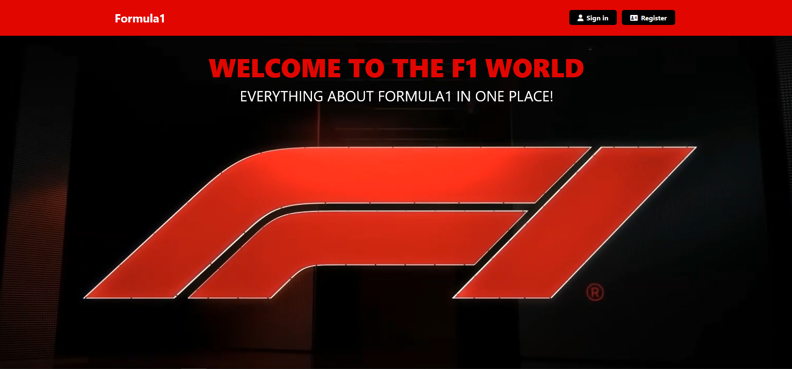

# Formula1-Website

This is the Formula 1 web project using ReactJS.The purpose of the project to provide a platform to Formula 1 fans to get information about teams, drivers and circuits!


<details open='open'>
 <summary>Table of Contents</summary>
<ul>
<li><a href="#features">Features</a></li>
<li><a href="#Screenshots">Screenshots</a></li>
<li><a href='#installation'>Installation</a></li>
<li><a></a></li>
<li><a></a></li>
</details>

</ul>

   ## Features

   <ul>

   <li></li>
    <li></li>
     <li></li>
      <li></li>
       <li></li>
   
   
   
   </ul>

  

  


   ## Screenshots
   ### Home Page
   </img>

   ### Drivers
   </img>

   ### Teams
   </img>

   ### Cirtuits
   </img>


    


## Start the project
### Installation

1. Clone the repo
   ```sh
   git clone https://github.com/GabrielDokov/Formula1-Website.git
   ```
2. Go to the server directory and NPM install packages
   ```sh
   cd ./server
   npm install
   ```
3. Go to the app directory and NPM install packages
   ```sh
   cd ./app
   npm install
   ```
4. Start the server
   ```sh
   npm run dev
   ```
5. Start the React app
   ```sh
   npm start
   ```


